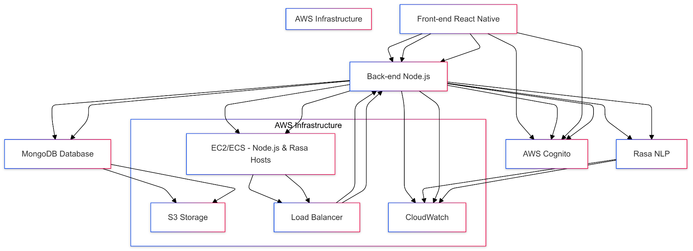

# Chatbot da Dra. Jô

Este projeto é um chatbot desenvolvido para atender aos clientes da Dra. Jô, com foco em auxiliar nas vendas, agendamentos, e oferecer suporte rápido e personalizado. O chatbot será integrado a um aplicativo iOS, Android e Web, utilizando tecnologias como React Native, Rasa, Node.js, MongoDB e AWS.

## Objetivo

O objetivo do chatbot é otimizar o processo de atendimento ao cliente com ênfase em vendas, oferecendo informações sobre produtos e serviços, além de facilitar o contato e agendamentos. A solução busca melhorar a eficiência do atendimento, proporcionando uma experiência de usuário intuitiva e rápida, o que ajudará a aumentar a conversão de leads e a satisfação dos clientes.

## Tecnologias Utilizadas

- **Frontend (React Native)**: Criação do aplicativo para iOS, Android e Web, oferecendo uma interface amigável e fácil de usar.
- **Motor de Processamento de Linguagem Natural (Rasa)**: Integração com o Rasa para compreensão de linguagem natural, possibilitando respostas precisas e personalizadas para as consultas dos clientes.
- **Backend (Node.js)**: Camada de lógica de negócios, responsável por integrar o chatbot com o Rasa e o banco de dados MongoDB.
- **Banco de Dados (MongoDB)**: Armazenamento das informações dos clientes e histórico de interações para análise e melhoria contínua.
- **Infraestrutura (AWS)**: Hospedagem do backend e do Rasa na AWS para escalabilidade, desempenho e segurança. Inclui serviços como EC2, S3, Load Balancer, API Gateway e CloudWatch.

## Arquitetura da Solução

A arquitetura do chatbot foi projetada com base nos seguintes componentes:

1. **Interface de Usuário (Front-end)**:
   - Aplicativo em React Native para iOS, Android e Web.
   - Interface intuitiva para comunicação direta com os usuários, facilitando consultas e navegação.

2. **Motor de NLP (Rasa)**:
   - Responsável por interpretar as mensagens dos clientes e identificar intenções de venda, suporte ou agendamento.
   - Treinamento contínuo com dados de interações para melhorar a precisão das respostas.

3. **Backend (Node.js)**:
   - Integração entre o frontend e o Rasa.
   - Lógica de negócios centralizada para gerenciar interações, integrar com o banco de dados e armazenar o histórico de atendimento.

4. **Banco de Dados (MongoDB)**:
   - Armazenamento das informações dos clientes, histórico de conversas e dados de vendas.
   - Permite análise de interações para ajustes e melhorias futuras no chatbot.

5. **Infraestrutura na AWS**:
   - **EC2/ECS**: Hospedagem do backend Node.js e do Rasa para garantir escalabilidade e alto desempenho.
   - **S3**: Armazenamento de dados estáticos e logs.
   - **Load Balancer e API Gateway**: Gerenciamento do tráfego e distribuição de carga.
   - **CloudWatch**: Monitoramento e análise de desempenho.
   - **AWS Cognito**: Autenticação segura dos usuários.

## Estimativa de Custos Mensais (em reais)

1. **Amazon EC2 (Instância para Node.js e Rasa)**:
   - Tipo de instância: t3.medium (2 vCPUs, 4 GB RAM).
   - Custo: Aproximadamente R\$175 por mês por instância.

2. **Amazon S3 (Armazenamento de Dados)**:
   - Armazenamento para logs e backups.
   - Custo: R\$0,115 por GB/mês (estimativa de 20 GB).
   - Estimativa: R\$2,30 por mês.

3. **Amazon API Gateway**:
   - Custo: R\$17,50 por 1 milhão de solicitações.
   - Estimativa: R\$50 a R\$100 por mês (baseado em volume moderado de tráfego).

4. **Amazon Load Balancer**:
   - Custo: Aproximadamente R\$90 por mês, mais custos de tráfego.
   - Estimativa total: R\$125 por mês.

5. **Amazon CloudWatch**:
   - Monitoramento de logs e métricas.
   - Custo: R\$0,50 por 1 milhão de eventos.
   - Estimativa: R\$25 a R\$50 por mês.

6. **AWS Cognito**:
   - Gratuito para até 50.000 usuários ativos mensais; após isso, R\$0,0275 por usuário adicional.
   - Estimativa: Gratuito inicialmente.

7. **MongoDB Atlas**:
   - Plano inicial a partir de R\$45 por mês para instâncias compartilhadas de baixa capacidade.
   - Estimativa: R\$45 a R\$125 por mês, dependendo do uso.

8. **Rasa Open Source** (Hospedado na AWS):
   - Custo de hospedagem incluso nas instâncias EC2.
   - Sem custo adicional para o próprio software Rasa, pois é open-source.

**Custo Total Estimado**: Aproximadamente R\$550 a R\$700 por mês, dependendo do tráfego e do uso de armazenamento.

## Funcionalidades do Chatbot

- **Atendimento a Clientes**: Responde a perguntas sobre produtos e serviços, oferecendo informações detalhadas e orientadas para a venda.
- **Agendamentos**: Facilita o processo de agendamento de consultas e reuniões.
- **Informações de Produtos**: Fornece informações técnicas e comerciais sobre produtos e serviços.
- **Suporte Técnico**: Ajuda os clientes a resolver problemas comuns e fornece orientação sobre os serviços da Dra. Jô.
- **Personalização**: Baseado em NLP, o chatbot oferece respostas personalizadas de acordo com o perfil e histórico do usuário.

## Escopo e Objetivo

- **Objetivo Principal**: Aumentar as vendas e melhorar o atendimento ao cliente.
- **Escopo**:
   - Chatbot voltado para vendas e suporte.
   - Interface acessível e responsiva.
   - Capacidade de escalar conforme a demanda aumenta.

## Considerações de Segurança e LGPD

- **Autenticação**: Implementada com AWS Cognito para garantir que apenas usuários autenticados tenham acesso.
- **Privacidade**: O chatbot foi projetado em conformidade com a LGPD, assegurando que todos os dados do usuário sejam armazenados e gerenciados de forma segura.
- **Criptografia**: Todas as comunicações são criptografadas via HTTPS para proteger as informações transmitidas entre o cliente e o servidor.

## Boas Práticas e Manutenção

- **Dados de Treinamento**: O Rasa será treinado com dados reais e ajustado continuamente para melhorar a precisão do atendimento.
- **Monitoramento**: Utilização do CloudWatch para monitorar o desempenho e gerar insights sobre o uso e o fluxo de conversas.
- **Escalabilidade**: A arquitetura baseada em microsserviços e hospedagem na AWS permite fácil escalabilidade para atender a um número crescente de usuários.

## Como Contribuir

1. Faça um fork do repositório e clone-o localmente.
2. Crie uma branch para sua modificação: `git checkout -b minha-modificacao`
3. Faça as alterações necessárias e commit: `git commit -m 'Minha contribuição'`
4. Envie as mudanças para o repositório: `git push origin minha-modificacao`
5. Abra um Pull Request para revisão.

---
